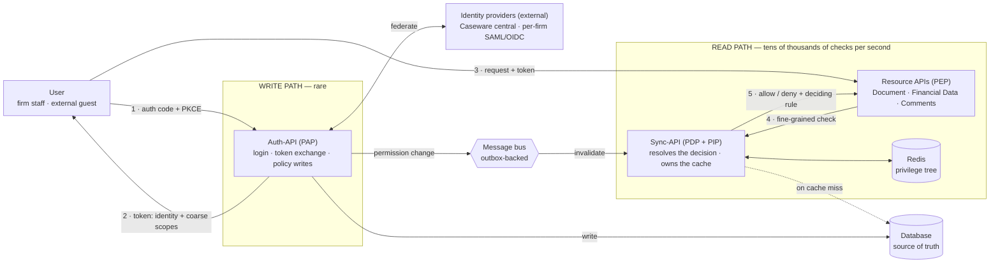

# 01 — Component architecture · v1 (horizontal layout)

Identity & Authorization Design — Collaborate

> **Superseded by v2.** Kept for reference. This layout renders at roughly 4:1, which is
> too wide to read at page size, and the `federate`, `2 · token` and `write` edges cross
> the whole canvas. The content is the same as v2.

