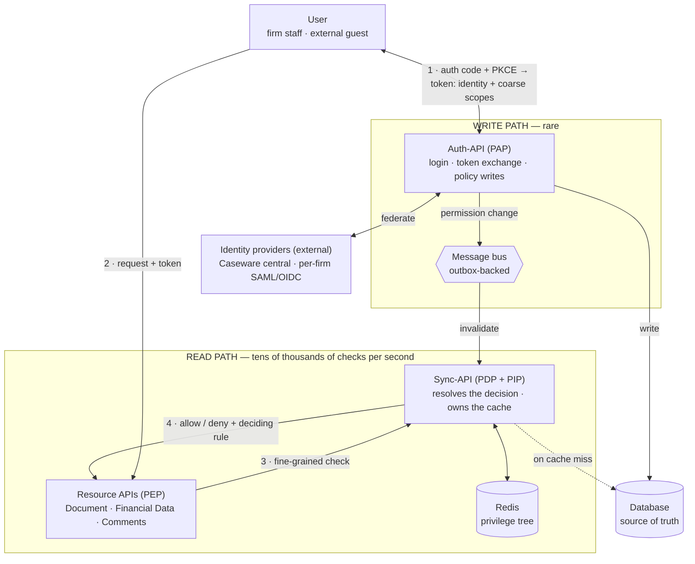

# 01 — Component architecture · v2 (vertical layout)

Identity & Authorization Design — Collaborate

> **Current version.** Vertical layout, the message bus moved inside the write path so the
> subgraph is not mostly empty, and steps 1 and 2 collapsed into one bidirectional edge to
> remove the long return loop. Export this one as `01-architecture.png`.

The token issued at step 1 carries identity and coarse scopes only. The fine-grained
decision at step 3 is resolved per request, which is what lets a revocation take effect
while that token is still valid.
